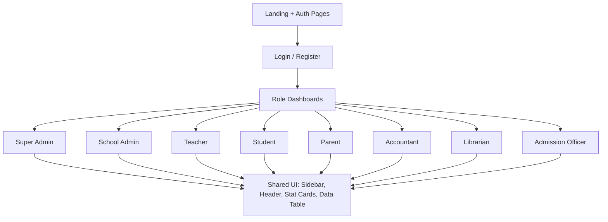

# GSMS Frontend Framework Picture

```mermaid
flowchart TD
  Landing[Landing + Auth Pages] --> Login[Login / Register]
  Login --> Dashboards[Role Dashboards]

  Dashboards --> SA[Super Admin]
  Dashboards --> SCA[School Admin]
  Dashboards --> T[Teacher]
  Dashboards --> ST[Student]
  Dashboards --> P[Parent]
  Dashboards --> A[Accountant]
  Dashboards --> L[Librarian]
  Dashboards --> AO[Admission Officer]

  SA --> Shared[Shared UI: Sidebar, Header, Stat Cards, Data Table]
  SCA --> Shared
  T --> Shared
  ST --> Shared
  P --> Shared
  A --> Shared
  L --> Shared
  AO --> Shared
```
