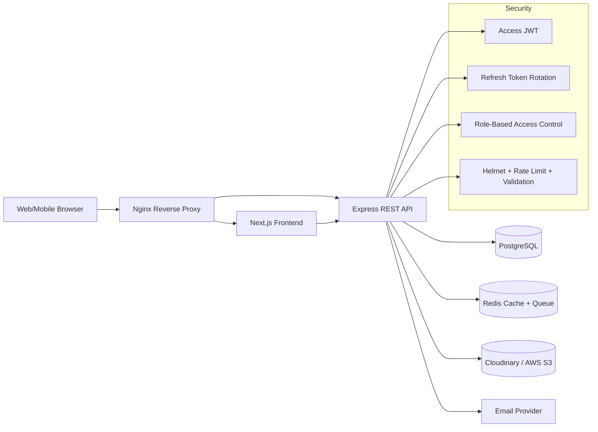

# GSMS — Step 1: System Architecture & Folder Structure

This document defines the production-grade architecture baseline for the **Global School Management System (GSMS)**.

## 1) Architecture Goals

- Multi-tenant-ready design for international schools.
- Modular monolith first, microservice-friendly later.
- Security by default (RBAC, JWT + refresh, validation, rate limiting).
- Clear separation of concerns across UI, API, domain, and infrastructure.
- Cloud-native deployment with Docker, Nginx, CI/CD, and observability.

## 2) High-Level System Architecture



## 3) Backend Architectural Style

### 3.1 Layered + Domain Modules

Each module follows this internal flow:

`Route -> Validation -> Controller -> Service -> Repository -> DB`

### 3.2 Module Boundaries

- `auth` (login/register/forgot-password/token lifecycle)
- `users` (user, role, permission management)
- `students` (profiles, guardians, docs, class allocation)
- `teachers` (profiles, subjects, salary, attendance)
- `academics` (classes, sections, subjects, timetable)
- `attendance` (student/teacher attendance + reports)
- `exams` (exam setup, grading, result management)
- `cbt` (computer-based tests, timer, anti-cheat events)
- `assignments` (homework creation/submission/feedback)
- `finance` (fees, invoices, payments, receipts, reports)
- `library` (books, borrow, return, fines)
- `communication` (announcements, messages, notifications)
- `analytics` (aggregated KPIs and role dashboards)

### 3.3 Cross-Cutting Components

- `middlewares` for auth, RBAC, input validation, error handling.
- `security` helpers for hashing, encryption, secure token utilities.
- `shared` for DTOs, constants, logging wrappers, API response contracts.

## 4) Frontend Architecture (Next.js + TypeScript)

### 4.1 UI Principles

- Mobile-first responsive layouts.
- Reusable component library (forms/tables/charts/modals).
- Accessible components (keyboard nav, aria labels, contrast-friendly).
- Theme support (light/dark mode).

### 4.2 Frontend Structure

- `app/(public)` for landing/auth flows.
- `app/(dashboard)` for role-specific dashboards.
- `components/ui` for design system primitives.
- `components/features` for module-level screens.
- `lib/api` for typed API clients and token handling.
- `store` for session + app state.

## 5) Security Baseline (Phase 1 Definition)

- Password hashing using bcrypt with configurable cost factor.
- JWT access token (short TTL) + refresh token (rotation + revocation).
- RBAC guards at route and service level.
- Helmet for secure headers.
- Rate limiting and brute-force mitigation on auth endpoints.
- Input validation with strict schema enforcement.
- SQL injection prevention via parameterized queries/ORM bindings.
- CSRF defenses for cookie-based refresh/token endpoints.
- Audit logging for high-risk actions (auth, grade edits, finance operations).

## 6) Proposed Monorepo Folder Structure

```text
gsms/
├── apps/
│   ├── web/                          # Next.js frontend
│   │   ├── public/
│   │   ├── src/
│   │   │   ├── app/
│   │   │   │   ├── (public)/
│   │   │   │   │   ├── page.tsx
│   │   │   │   │   ├── login/page.tsx
│   │   │   │   │   └── register/page.tsx
│   │   │   │   ├── (dashboard)/
│   │   │   │   │   ├── super-admin/
│   │   │   │   │   ├── school-admin/
│   │   │   │   │   ├── teacher/
│   │   │   │   │   ├── student/
│   │   │   │   │   ├── parent/
│   │   │   │   │   ├── accountant/
│   │   │   │   │   ├── librarian/
│   │   │   │   │   └── admission-officer/
│   │   │   │   └── api/              # Next.js route handlers if needed
│   │   │   ├── components/
│   │   │   │   ├── ui/
│   │   │   │   ├── layout/
│   │   │   │   └── features/
│   │   │   ├── lib/
│   │   │   │   ├── api/
│   │   │   │   ├── auth/
│   │   │   │   └── utils/
│   │   │   ├── store/
│   │   │   ├── hooks/
│   │   │   ├── styles/
│   │   │   └── types/
│   │   ├── tailwind.config.ts
│   │   ├── tsconfig.json
│   │   └── next.config.js
│   │
│   └── api/                          # Node.js + Express backend
│       ├── src/
│       │   ├── app.ts
│       │   ├── server.ts
│       │   ├── config/
│       │   │   ├── env.ts
│       │   │   ├── db.ts
│       │   │   ├── logger.ts
│       │   │   └── security.ts
│       │   ├── middlewares/
│       │   │   ├── auth.middleware.ts
│       │   │   ├── rbac.middleware.ts
│       │   │   ├── validate.middleware.ts
│       │   │   ├── rateLimit.middleware.ts
│       │   │   └── error.middleware.ts
│       │   ├── modules/
│       │   │   ├── auth/
│       │   │   │   ├── auth.routes.ts
│       │   │   │   ├── auth.controller.ts
│       │   │   │   ├── auth.service.ts
│       │   │   │   ├── auth.repository.ts
│       │   │   │   └── auth.schemas.ts
│       │   │   ├── users/
│       │   │   ├── students/
│       │   │   ├── teachers/
│       │   │   ├── academics/
│       │   │   ├── attendance/
│       │   │   ├── exams/
│       │   │   ├── cbt/
│       │   │   ├── assignments/
│       │   │   ├── finance/
│       │   │   ├── library/
│       │   │   ├── communication/
│       │   │   └── analytics/
│       │   ├── shared/
│       │   │   ├── constants/
│       │   │   ├── types/
│       │   │   ├── errors/
│       │   │   └── utils/
│       │   └── jobs/                 # Background tasks / queues
│       ├── prisma/                   # or migrations/ if knex/sequelize
│       ├── tests/
│       ├── package.json
│       └── tsconfig.json
│
├── packages/
│   ├── eslint-config/
│   ├── types/                        # Shared DTO/contracts
│   └── ui/                           # Shared design system (optional)
│
├── infrastructure/
│   ├── docker/
│   │   ├── Dockerfile.web
│   │   ├── Dockerfile.api
│   │   └── docker-compose.yml
│   ├── nginx/
│   │   └── nginx.conf
│   └── ci-cd/
│       └── github-actions.yml
│
├── docs/
│   ├── architecture/
│   ├── api/
│   ├── database/
│   └── runbooks/
│
├── .env.example
├── package.json                      # Workspace root
└── README.md
```

## 7) API Naming & Versioning Convention

- Prefix all endpoints with `/api/v1`.
- Domain-grouped resources, for example:
  - `/api/v1/auth/login`
  - `/api/v1/students`
  - `/api/v1/classes`
  - `/api/v1/exams`
  - `/api/v1/results`

## 8) Environment Strategy

- `.env` per runtime target (`development`, `test`, `production`).
- Separate secrets manager integration for production.
- Mandatory startup validation for required env variables.

## 9) Logging & Observability

- Structured JSON logs (`info`, `warn`, `error`, `audit`).
- Correlation IDs for request tracing.
- Health checks: `/health/live` and `/health/ready`.
- Metrics-ready instrumentation for future Prometheus/Grafana.

## 10) Phase 1 Deliverable Exit Criteria

Step 1 is complete when:

1. Architecture decision record exists and is approved.
2. Folder structure is scaffolded according to this document.
3. Security baseline and module boundaries are documented.
4. API versioning and coding conventions are agreed.

---

### Next Step (Step 2)

Design the normalized PostgreSQL schema with table relationships, constraints, indexing strategy, and ER diagram.
