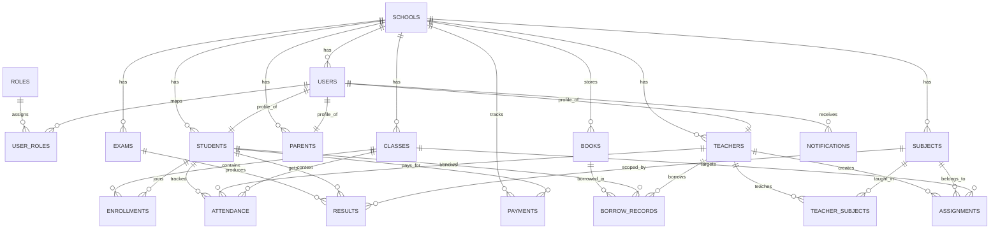

# GSMS — Step 2: PostgreSQL Database Design

This document provides a normalized relational schema for the **Global School Management System (GSMS)**.

## 1) Design Principles

- **3NF-oriented modeling** to reduce redundancy and update anomalies.
- **Tenant-aware model** (`schools` as top-level partition key for most business tables).
- **Auditability** via `created_at`, `updated_at`, `created_by`, and soft-delete patterns where appropriate.
- **Strong integrity** using foreign keys, `CHECK` constraints, unique constraints, and enums.
- **Performance-first indexing** for high-frequency filters (school, date ranges, status, class, student, exam).

## 2) ER Diagram (Core Entities)



## 3) Logical Table Set (Required + Supporting)

### 3.1 Supporting Identity & Tenant Tables

- `schools`
- `users`
- `roles`
- `user_roles`
- `refresh_tokens`

### 3.2 Required Domain Tables (as requested)

- `students`
- `teachers`
- `parents`
- `classes`
- `subjects`
- `enrollments`
- `attendance`
- `exams`
- `results`
- `assignments`
- `payments`
- `books`
- `borrow_records`
- `notifications`

### 3.3 Additional Recommended Tables (for production completeness)

- `student_parents` (many-to-many guardian mapping)
- `sections`
- `teacher_salary_records`
- `question_banks`
- `exam_questions`
- `assignment_submissions`
- `fee_structures`
- `audit_logs`

## 4) PostgreSQL Schema (Core DDL)

> Notes:
> - UUIDs are used as primary keys.
> - All business tables include `school_id` to enforce tenant boundary.
> - `attendance` supports both student and teacher attendance using nullable foreign keys + check constraint.

```sql
-- Extensions
CREATE EXTENSION IF NOT EXISTS "pgcrypto";

-- ==============================
-- Tenant / Identity
-- ==============================

CREATE TABLE schools (
  id UUID PRIMARY KEY DEFAULT gen_random_uuid(),
  name VARCHAR(150) NOT NULL,
  code VARCHAR(30) NOT NULL UNIQUE,
  country VARCHAR(80) NOT NULL,
  timezone VARCHAR(64) NOT NULL,
  is_active BOOLEAN NOT NULL DEFAULT TRUE,
  created_at TIMESTAMPTZ NOT NULL DEFAULT NOW(),
  updated_at TIMESTAMPTZ NOT NULL DEFAULT NOW()
);

CREATE TABLE roles (
  id UUID PRIMARY KEY DEFAULT gen_random_uuid(),
  name VARCHAR(50) NOT NULL UNIQUE, -- SUPER_ADMIN, SCHOOL_ADMIN, TEACHER, STUDENT, PARENT, ACCOUNTANT, LIBRARIAN, ADMISSION_OFFICER
  description TEXT,
  created_at TIMESTAMPTZ NOT NULL DEFAULT NOW(),
  updated_at TIMESTAMPTZ NOT NULL DEFAULT NOW()
);

CREATE TABLE users (
  id UUID PRIMARY KEY DEFAULT gen_random_uuid(),
  school_id UUID REFERENCES schools(id) ON DELETE CASCADE,
  email VARCHAR(255) NOT NULL UNIQUE,
  password_hash TEXT NOT NULL,
  first_name VARCHAR(80) NOT NULL,
  last_name VARCHAR(80) NOT NULL,
  phone VARCHAR(30),
  avatar_url TEXT,
  is_email_verified BOOLEAN NOT NULL DEFAULT FALSE,
  is_active BOOLEAN NOT NULL DEFAULT TRUE,
  last_login_at TIMESTAMPTZ,
  created_at TIMESTAMPTZ NOT NULL DEFAULT NOW(),
  updated_at TIMESTAMPTZ NOT NULL DEFAULT NOW()
);

CREATE TABLE user_roles (
  id UUID PRIMARY KEY DEFAULT gen_random_uuid(),
  user_id UUID NOT NULL REFERENCES users(id) ON DELETE CASCADE,
  role_id UUID NOT NULL REFERENCES roles(id) ON DELETE RESTRICT,
  assigned_at TIMESTAMPTZ NOT NULL DEFAULT NOW(),
  UNIQUE (user_id, role_id)
);

CREATE TABLE refresh_tokens (
  id UUID PRIMARY KEY DEFAULT gen_random_uuid(),
  user_id UUID NOT NULL REFERENCES users(id) ON DELETE CASCADE,
  token_hash TEXT NOT NULL,
  expires_at TIMESTAMPTZ NOT NULL,
  revoked_at TIMESTAMPTZ,
  created_at TIMESTAMPTZ NOT NULL DEFAULT NOW(),
  UNIQUE (token_hash)
);

-- ==============================
-- Profiles
-- ==============================

CREATE TABLE students (
  id UUID PRIMARY KEY DEFAULT gen_random_uuid(),
  school_id UUID NOT NULL REFERENCES schools(id) ON DELETE CASCADE,
  user_id UUID UNIQUE NOT NULL REFERENCES users(id) ON DELETE CASCADE,
  admission_no VARCHAR(50) NOT NULL,
  student_id_code VARCHAR(50) NOT NULL,
  date_of_birth DATE,
  gender VARCHAR(20),
  admission_date DATE NOT NULL,
  status VARCHAR(30) NOT NULL DEFAULT 'ACTIVE',
  created_at TIMESTAMPTZ NOT NULL DEFAULT NOW(),
  updated_at TIMESTAMPTZ NOT NULL DEFAULT NOW(),
  UNIQUE (school_id, admission_no),
  UNIQUE (school_id, student_id_code)
);

CREATE TABLE teachers (
  id UUID PRIMARY KEY DEFAULT gen_random_uuid(),
  school_id UUID NOT NULL REFERENCES schools(id) ON DELETE CASCADE,
  user_id UUID UNIQUE NOT NULL REFERENCES users(id) ON DELETE CASCADE,
  employee_no VARCHAR(50) NOT NULL,
  hire_date DATE NOT NULL,
  department VARCHAR(100),
  qualification TEXT,
  employment_status VARCHAR(30) NOT NULL DEFAULT 'ACTIVE',
  created_at TIMESTAMPTZ NOT NULL DEFAULT NOW(),
  updated_at TIMESTAMPTZ NOT NULL DEFAULT NOW(),
  UNIQUE (school_id, employee_no)
);

CREATE TABLE parents (
  id UUID PRIMARY KEY DEFAULT gen_random_uuid(),
  school_id UUID NOT NULL REFERENCES schools(id) ON DELETE CASCADE,
  user_id UUID UNIQUE NOT NULL REFERENCES users(id) ON DELETE CASCADE,
  occupation VARCHAR(100),
  address_line_1 VARCHAR(200),
  address_line_2 VARCHAR(200),
  city VARCHAR(100),
  country VARCHAR(100),
  created_at TIMESTAMPTZ NOT NULL DEFAULT NOW(),
  updated_at TIMESTAMPTZ NOT NULL DEFAULT NOW()
);

CREATE TABLE student_parents (
  id UUID PRIMARY KEY DEFAULT gen_random_uuid(),
  school_id UUID NOT NULL REFERENCES schools(id) ON DELETE CASCADE,
  student_id UUID NOT NULL REFERENCES students(id) ON DELETE CASCADE,
  parent_id UUID NOT NULL REFERENCES parents(id) ON DELETE CASCADE,
  relationship_type VARCHAR(30) NOT NULL, -- father/mother/guardian/other
  is_primary_contact BOOLEAN NOT NULL DEFAULT FALSE,
  created_at TIMESTAMPTZ NOT NULL DEFAULT NOW(),
  UNIQUE (student_id, parent_id)
);

-- ==============================
-- Academics
-- ==============================

CREATE TABLE classes (
  id UUID PRIMARY KEY DEFAULT gen_random_uuid(),
  school_id UUID NOT NULL REFERENCES schools(id) ON DELETE CASCADE,
  class_name VARCHAR(50) NOT NULL,
  grade_level INTEGER NOT NULL,
  class_teacher_id UUID REFERENCES teachers(id) ON DELETE SET NULL,
  academic_year VARCHAR(20) NOT NULL,
  created_at TIMESTAMPTZ NOT NULL DEFAULT NOW(),
  updated_at TIMESTAMPTZ NOT NULL DEFAULT NOW(),
  UNIQUE (school_id, class_name, academic_year)
);

CREATE TABLE subjects (
  id UUID PRIMARY KEY DEFAULT gen_random_uuid(),
  school_id UUID NOT NULL REFERENCES schools(id) ON DELETE CASCADE,
  subject_code VARCHAR(30) NOT NULL,
  subject_name VARCHAR(100) NOT NULL,
  is_core BOOLEAN NOT NULL DEFAULT FALSE,
  created_at TIMESTAMPTZ NOT NULL DEFAULT NOW(),
  updated_at TIMESTAMPTZ NOT NULL DEFAULT NOW(),
  UNIQUE (school_id, subject_code)
);

CREATE TABLE teacher_subjects (
  id UUID PRIMARY KEY DEFAULT gen_random_uuid(),
  school_id UUID NOT NULL REFERENCES schools(id) ON DELETE CASCADE,
  teacher_id UUID NOT NULL REFERENCES teachers(id) ON DELETE CASCADE,
  subject_id UUID NOT NULL REFERENCES subjects(id) ON DELETE CASCADE,
  class_id UUID REFERENCES classes(id) ON DELETE CASCADE,
  created_at TIMESTAMPTZ NOT NULL DEFAULT NOW(),
  UNIQUE (teacher_id, subject_id, class_id)
);

CREATE TABLE enrollments (
  id UUID PRIMARY KEY DEFAULT gen_random_uuid(),
  school_id UUID NOT NULL REFERENCES schools(id) ON DELETE CASCADE,
  student_id UUID NOT NULL REFERENCES students(id) ON DELETE CASCADE,
  class_id UUID NOT NULL REFERENCES classes(id) ON DELETE CASCADE,
  roll_number VARCHAR(20),
  enrollment_date DATE NOT NULL,
  status VARCHAR(30) NOT NULL DEFAULT 'ENROLLED',
  created_at TIMESTAMPTZ NOT NULL DEFAULT NOW(),
  updated_at TIMESTAMPTZ NOT NULL DEFAULT NOW(),
  UNIQUE (student_id, class_id)
);

-- ==============================
-- Attendance
-- ==============================

CREATE TABLE attendance (
  id UUID PRIMARY KEY DEFAULT gen_random_uuid(),
  school_id UUID NOT NULL REFERENCES schools(id) ON DELETE CASCADE,
  class_id UUID REFERENCES classes(id) ON DELETE SET NULL,
  student_id UUID REFERENCES students(id) ON DELETE CASCADE,
  teacher_id UUID REFERENCES teachers(id) ON DELETE CASCADE,
  attendance_date DATE NOT NULL,
  status VARCHAR(15) NOT NULL, -- PRESENT, ABSENT, LATE, EXCUSED
  remark TEXT,
  marked_by UUID REFERENCES users(id) ON DELETE SET NULL,
  created_at TIMESTAMPTZ NOT NULL DEFAULT NOW(),
  updated_at TIMESTAMPTZ NOT NULL DEFAULT NOW(),
  CHECK (
    (student_id IS NOT NULL AND teacher_id IS NULL)
    OR (student_id IS NULL AND teacher_id IS NOT NULL)
  )
);

-- ==============================
-- Exams & Results
-- ==============================

CREATE TABLE exams (
  id UUID PRIMARY KEY DEFAULT gen_random_uuid(),
  school_id UUID NOT NULL REFERENCES schools(id) ON DELETE CASCADE,
  exam_name VARCHAR(120) NOT NULL,
  class_id UUID NOT NULL REFERENCES classes(id) ON DELETE CASCADE,
  exam_type VARCHAR(30) NOT NULL, -- MIDTERM/FINAL/QUIZ/CBT
  start_date DATE NOT NULL,
  end_date DATE NOT NULL,
  academic_year VARCHAR(20) NOT NULL,
  created_by UUID REFERENCES users(id) ON DELETE SET NULL,
  created_at TIMESTAMPTZ NOT NULL DEFAULT NOW(),
  updated_at TIMESTAMPTZ NOT NULL DEFAULT NOW(),
  CHECK (end_date >= start_date)
);

CREATE TABLE results (
  id UUID PRIMARY KEY DEFAULT gen_random_uuid(),
  school_id UUID NOT NULL REFERENCES schools(id) ON DELETE CASCADE,
  exam_id UUID NOT NULL REFERENCES exams(id) ON DELETE CASCADE,
  student_id UUID NOT NULL REFERENCES students(id) ON DELETE CASCADE,
  subject_id UUID NOT NULL REFERENCES subjects(id) ON DELETE CASCADE,
  score NUMERIC(6,2) NOT NULL,
  max_score NUMERIC(6,2) NOT NULL,
  grade VARCHAR(5),
  remarks TEXT,
  published_at TIMESTAMPTZ,
  created_at TIMESTAMPTZ NOT NULL DEFAULT NOW(),
  updated_at TIMESTAMPTZ NOT NULL DEFAULT NOW(),
  CHECK (max_score > 0),
  CHECK (score >= 0),
  CHECK (score <= max_score),
  UNIQUE (exam_id, student_id, subject_id)
);

-- ==============================
-- Assignments
-- ==============================

CREATE TABLE assignments (
  id UUID PRIMARY KEY DEFAULT gen_random_uuid(),
  school_id UUID NOT NULL REFERENCES schools(id) ON DELETE CASCADE,
  class_id UUID NOT NULL REFERENCES classes(id) ON DELETE CASCADE,
  subject_id UUID NOT NULL REFERENCES subjects(id) ON DELETE CASCADE,
  teacher_id UUID NOT NULL REFERENCES teachers(id) ON DELETE CASCADE,
  title VARCHAR(160) NOT NULL,
  instructions TEXT,
  due_date TIMESTAMPTZ NOT NULL,
  max_score NUMERIC(6,2) NOT NULL DEFAULT 100,
  attachment_url TEXT,
  created_at TIMESTAMPTZ NOT NULL DEFAULT NOW(),
  updated_at TIMESTAMPTZ NOT NULL DEFAULT NOW(),
  CHECK (max_score > 0)
);

-- ==============================
-- Finance
-- ==============================

CREATE TABLE payments (
  id UUID PRIMARY KEY DEFAULT gen_random_uuid(),
  school_id UUID NOT NULL REFERENCES schools(id) ON DELETE CASCADE,
  student_id UUID NOT NULL REFERENCES students(id) ON DELETE RESTRICT,
  receipt_no VARCHAR(50) NOT NULL,
  amount NUMERIC(12,2) NOT NULL,
  currency CHAR(3) NOT NULL DEFAULT 'USD',
  payment_method VARCHAR(30) NOT NULL, -- CASH/CARD/BANK_TRANSFER/ONLINE
  payment_status VARCHAR(20) NOT NULL, -- PENDING/SUCCESS/FAILED/REFUNDED
  paid_at TIMESTAMPTZ,
  transaction_ref VARCHAR(120),
  created_by UUID REFERENCES users(id) ON DELETE SET NULL,
  created_at TIMESTAMPTZ NOT NULL DEFAULT NOW(),
  updated_at TIMESTAMPTZ NOT NULL DEFAULT NOW(),
  CHECK (amount > 0),
  UNIQUE (school_id, receipt_no)
);

-- ==============================
-- Library
-- ==============================

CREATE TABLE books (
  id UUID PRIMARY KEY DEFAULT gen_random_uuid(),
  school_id UUID NOT NULL REFERENCES schools(id) ON DELETE CASCADE,
  isbn VARCHAR(20),
  title VARCHAR(200) NOT NULL,
  author VARCHAR(150),
  publisher VARCHAR(150),
  published_year INTEGER,
  total_copies INTEGER NOT NULL DEFAULT 1,
  available_copies INTEGER NOT NULL DEFAULT 1,
  shelf_code VARCHAR(50),
  created_at TIMESTAMPTZ NOT NULL DEFAULT NOW(),
  updated_at TIMESTAMPTZ NOT NULL DEFAULT NOW(),
  CHECK (total_copies >= 0),
  CHECK (available_copies >= 0),
  CHECK (available_copies <= total_copies),
  UNIQUE (school_id, isbn)
);

CREATE TABLE borrow_records (
  id UUID PRIMARY KEY DEFAULT gen_random_uuid(),
  school_id UUID NOT NULL REFERENCES schools(id) ON DELETE CASCADE,
  book_id UUID NOT NULL REFERENCES books(id) ON DELETE RESTRICT,
  student_id UUID REFERENCES students(id) ON DELETE SET NULL,
  teacher_id UUID REFERENCES teachers(id) ON DELETE SET NULL,
  borrowed_at TIMESTAMPTZ NOT NULL DEFAULT NOW(),
  due_at TIMESTAMPTZ NOT NULL,
  returned_at TIMESTAMPTZ,
  fine_amount NUMERIC(10,2) NOT NULL DEFAULT 0,
  created_at TIMESTAMPTZ NOT NULL DEFAULT NOW(),
  CHECK (
    (student_id IS NOT NULL AND teacher_id IS NULL)
    OR (student_id IS NULL AND teacher_id IS NOT NULL)
  ),
  CHECK (fine_amount >= 0)
);

-- ==============================
-- Communication
-- ==============================

CREATE TABLE notifications (
  id UUID PRIMARY KEY DEFAULT gen_random_uuid(),
  school_id UUID NOT NULL REFERENCES schools(id) ON DELETE CASCADE,
  user_id UUID NOT NULL REFERENCES users(id) ON DELETE CASCADE,
  notification_type VARCHAR(30) NOT NULL, -- ANNOUNCEMENT/MESSAGE/ALERT
  title VARCHAR(160) NOT NULL,
  body TEXT NOT NULL,
  is_read BOOLEAN NOT NULL DEFAULT FALSE,
  read_at TIMESTAMPTZ,
  created_at TIMESTAMPTZ NOT NULL DEFAULT NOW()
);
```

## 5) Relationship Summary

- One `school` has many `users`, `students`, `teachers`, `parents`, `classes`, `subjects`, and all transactional records.
- `users` and `roles` are many-to-many via `user_roles`.
- `students`, `teachers`, `parents` each map 1:1 to `users` for authentication identity.
- `students` and `parents` are many-to-many through `student_parents`.
- `students` enroll in `classes` via `enrollments` (many-to-many over time).
- `exams` belong to a `class`; `results` link exam + student + subject.
- `attendance` supports either a student row or teacher row per record.
- `borrow_records` supports either a student borrower or teacher borrower per record.

## 6) Indexing Strategy

### 6.1 Mandatory Operational Indexes

```sql
-- Tenant and identity indexes
CREATE INDEX idx_users_school_id ON users(school_id);
CREATE INDEX idx_students_school_id ON students(school_id);
CREATE INDEX idx_teachers_school_id ON teachers(school_id);
CREATE INDEX idx_parents_school_id ON parents(school_id);

-- Enrollment and class operations
CREATE INDEX idx_enrollments_class_id ON enrollments(class_id);
CREATE INDEX idx_enrollments_student_id ON enrollments(student_id);
CREATE INDEX idx_classes_school_year ON classes(school_id, academic_year);

-- Attendance analytics
CREATE INDEX idx_attendance_school_date ON attendance(school_id, attendance_date);
CREATE INDEX idx_attendance_student_date ON attendance(student_id, attendance_date);
CREATE INDEX idx_attendance_teacher_date ON attendance(teacher_id, attendance_date);

-- Exams & results
CREATE INDEX idx_exams_class_year ON exams(class_id, academic_year);
CREATE INDEX idx_results_exam_id ON results(exam_id);
CREATE INDEX idx_results_student_id ON results(student_id);
CREATE INDEX idx_results_subject_id ON results(subject_id);

-- Assignments
CREATE INDEX idx_assignments_class_due ON assignments(class_id, due_date);
CREATE INDEX idx_assignments_teacher_id ON assignments(teacher_id);

-- Finance
CREATE INDEX idx_payments_student_paid_at ON payments(student_id, paid_at DESC);
CREATE INDEX idx_payments_status ON payments(payment_status);

-- Library
CREATE INDEX idx_books_school_title ON books(school_id, title);
CREATE INDEX idx_borrow_book_due ON borrow_records(book_id, due_at);

-- Notifications
CREATE INDEX idx_notifications_user_unread ON notifications(user_id, is_read, created_at DESC);
```

### 6.2 Optional Advanced Indexes

- Partial index for unread notifications:
  - `CREATE INDEX ... ON notifications(user_id, created_at DESC) WHERE is_read = false;`
- GIN trigram index for fuzzy book/title search.
- BRIN index on large time-series attendance tables after significant growth.

## 7) Data Integrity & Security Controls

- Use parameterized queries in repositories/ORM-generated bindings.
- Keep PII fields encrypted at rest when required by local regulations.
- Store only hashed refresh tokens (`token_hash`), not raw tokens.
- Add row-level tenant guard in service/repository queries (`WHERE school_id = ?`).
- Add immutable `audit_logs` for grade updates, payment changes, and role changes.

## 8) Migration & Seed Strategy

1. Bootstrap core identity tables: `schools`, `roles`, `users`, `user_roles`.
2. Seed fixed role records.
3. Apply domain tables in dependency order (profiles -> academics -> transactions).
4. Seed one demo school with role users for QA.
5. Add repeatable migration checks in CI/CD.

## 9) Phase 2 Exit Criteria

Step 2 is complete when:

1. ER diagram and logical relationships are approved.
2. SQL schema validated in PostgreSQL.
3. Index strategy benchmarked against core queries.
4. Migration ordering and seed approach documented.

---

### Next Step (Step 3)

Backend project setup (Node.js + Express + TypeScript), environment config, logging, security middleware scaffolding, and base API routing.
